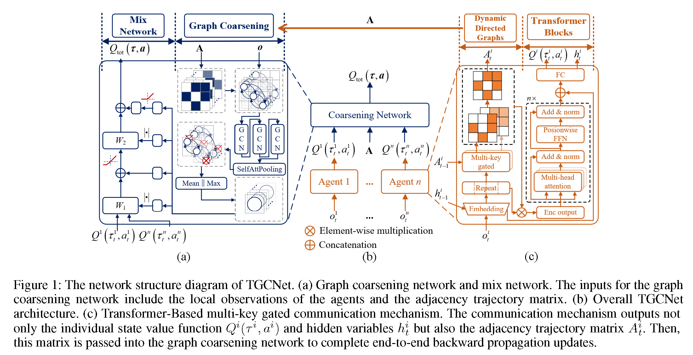

# TGCNet (Transformer-Based Graph Coarsening Network)
Official implementation of the paper *"Bridging Training and Execution via Dynamic Directed Graph-Based Communication in Cooperative Multi-Agent Systems"* (AAAI Oral 2025). This repository contains PyTorch code for training and evaluating TGCNet on cooperative multi-agent benchmarks including [StarCraft Multi-Agent Challenge (SMAC)](https://github.com/oxwhirl/smac), [Level-Based Foraging (LBF)](https://github.com/uoe-agents/lb-foraging), and [Hallway](https://github.com/TonghanWang/NDQ). The implementation is built upon the [EPyMARL](https://github.com/uoe-agents/epymarl) framework.

## Overview
*Framework Overview: Dynamic graph construction and coarsening process during agent interactions*
  
**Paper Details**:  
📄 **[Bridging Training and Execution via Dynamic Directed Graph-Based Communication in Cooperative Multi-Agent Systems](https://arxiv.org/abs/2408.07397v2)**  

## Repository Structure
```bash
.
├── README.md
└── src
    ├── components/          # Core components (buffers, schedules, transforms)
    ├── config/              # Configuration files
    │   ├── algs/tgcnet.yaml # TGCNet hyperparameters
    │   ├── default.yaml     # Base configuration
    │   └── envs/           # Environment-specific settings
    ├── controllers/         # Training controllers
    ├── envs/                # Environment wrappers
    ├── learners/            # Learning algorithms
    ├── modules/             # Neural network modules
    │   ├── agents/         # Agent architectures
    │   ├── layers/         # Custom neural layers
    │   └── mixers/         # Value mixing networks
    ├── runners/             # Experiment runners
    └── utils/               # Utility functions
```

## Installation
1. Clone the repository:
```bash
git clone https://github.com/ZhuohuiZhang/tgcnet.git
cd tgcnet
```
2. Install dependencies:
```bash
conda create -n tgcnet python=3.11
conda activate tgcnet
pip install -r requirements.txt
```

## Usage
### Training
```bash
python src/main.py --alg-config=tgcnet --env-config=sc2 with env_args.map_name="corridor"
```
### Supported Tasks
| Environment | Config File         | Example Command                          |
|-------------|---------------------|------------------------------------------|
| SMAC        | config/envs/sc2.yaml| `--env-config=sc2 with env_args.map_name="2s_vs_1sc"` |
| LBF         | config/envs/gymma.yaml| `--env-config=gymma with env_args.time_limit=25 env_args.key="lbforaging:Foraging-11x11-6p-4f-v2"` |
| Hallway     | config/envs/hallway.yaml| `--env-config=hallway` |


## Citation
Please consider to cite our paper if you find TGCNet helpful in your research:
```
@inproceedings{zhang2024bridging,
  title={Bridging Training and Execution via Dynamic Directed Graph-Based Communication in Cooperative Multi-Agent Systems},
  author={Zhang, Zhuohui and He, Bin and Cheng, Bin and Li, Gang},
  booktitle={Proceedings of the AAAI Conference on Artificial Intelligence},
  year={2025},
  address = {Philadelphia, Pennsylvania, USA}
}
```


